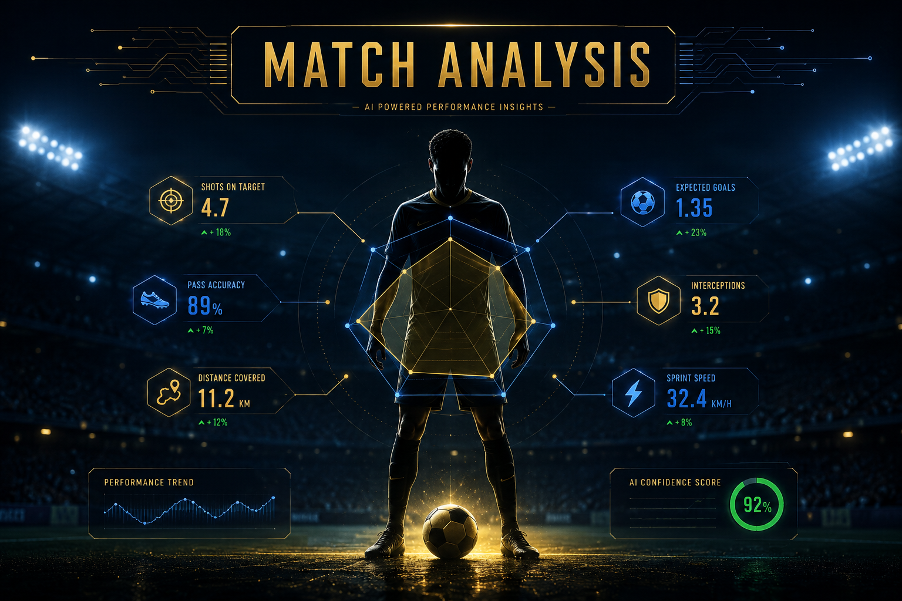
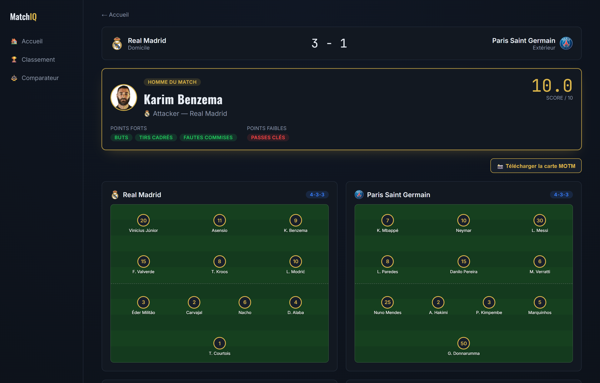
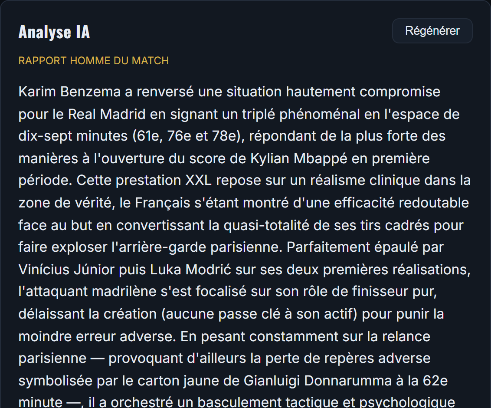
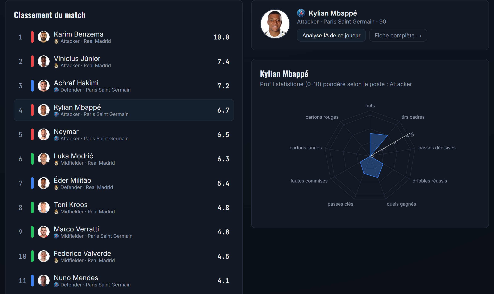
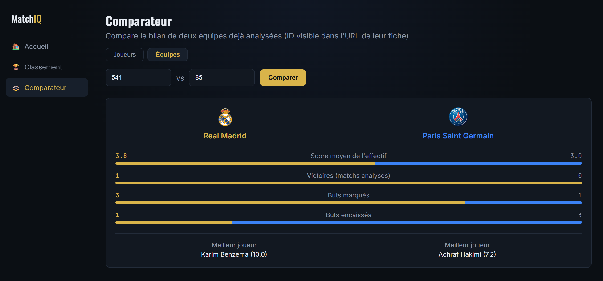
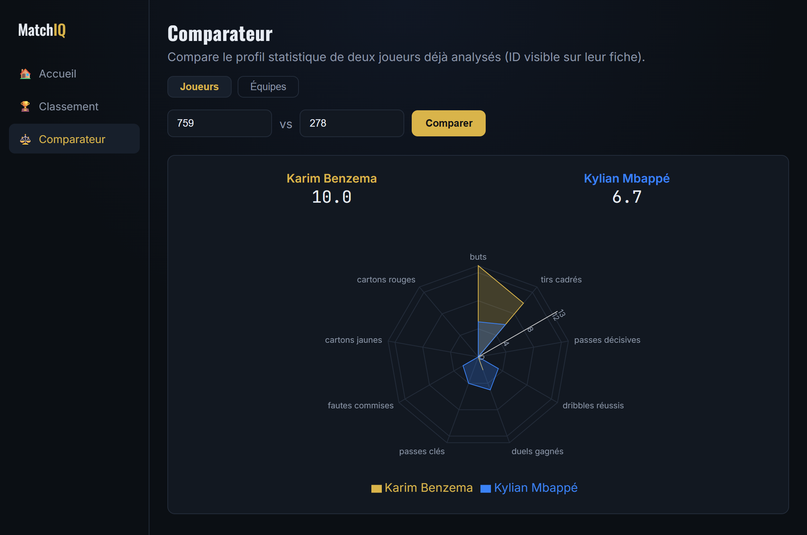
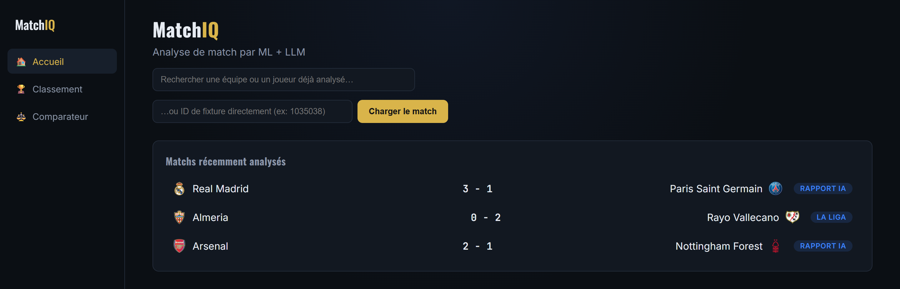
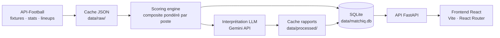

# MatchIQ

[](https://www.python.org/)
[](https://fastapi.tiangolo.com/)
[](https://react.dev/)
[](https://vitejs.dev/)
[](https://www.sqlite.org/)
[](https://ai.google.dev/)
[](https://github.com/baDrsh531/matchiq/actions/workflows/tests.yml)
[](LICENSE)

**Analyse de match de football : le ML calcule les scores, le LLM les interprète.**



## Pourquoi ce projet

Les statistiques brutes d'un match de foot (passes, tirs, duels, xG) sont abondantes mais muettes :
elles disent *ce qui s'est passé*, jamais *pourquoi ça a compté*. MatchIQ répond à ce manque en deux
temps — un moteur de scoring composite pondéré par poste transforme les stats d'un joueur en une note
unique et comparable, puis un LLM (Gemini) traduit ces scores en un rapport de match lisible : homme
du match justifié, lecture tactique, points forts et faiblesses de chaque joueur.

Le résultat est un rapport que peut lire un supporter, appuyé sur des chiffres qu'accepterait un
analyste — et une démonstration de bout en bout d'un pipeline *ingestion → ML → LLM → API → UI*.

## Aperçu

*Captures réelles de l'application — Real Madrid 3–1 PSG, huitième de finale retour de Ligue des
Champions 2021/22 (le triplé de Benzema en dix-sept minutes).*

**Rapport de match** — score, homme du match calculé par le moteur de scoring, et formations
tactiques reconstruites depuis les compositions officielles.



**Interprétation LLM** — le rapport est rédigé par Gemini à partir des scores calculés, en citant
les statistiques qui justifient la note.



**Classement du match et profil joueur** — chaque joueur reçoit un score composite pondéré selon son
poste, détaillé en radar chart.



**Comparateur d'équipes** — bilan, buts et meilleur joueur de deux équipes déjà analysées.



**Comparateur de joueurs** — superposition des profils statistiques de deux joueurs.



**Accueil** — historique des matchs analysés et recherche par équipe, joueur ou identifiant de match.



## Architecture



Chaque étage est mis en cache : une réponse API-Football n'est téléchargée qu'une fois (`data/raw/`),
un rapport LLM n'est généré qu'une fois (`data/processed/`), et les scores calculés sont persistés en
SQLite pour alimenter l'historique et les fiches joueur/équipe sans recalcul.

### Organisation du code

| Dossier | Rôle |
|---|---|
| `ml/` | Ingestion API-Football, schémas, moteur de scoring, pondérations par poste |
| `llm/` | Client Gemini, templates de prompts, génération des rapports |
| `persistence/` | Modèles SQLAlchemy, session, repository |
| `api/` | Application FastAPI et routers |
| `frontend/` | SPA React (Vite, React Router) |
| `tests/` | Tests pytest (ingestion, scoring, LLM, persistence, rapports) |

## Routes API

| Route | Description |
|---|---|
| `GET /matches` | Historique des matchs déjà analysés (page d'accueil) |
| `GET /matches/{fixture_id}` | Infos générales, score, timeline des événements |
| `GET /matches/{fixture_id}/players` | Scores composites de tous les joueurs (triés, MOTM en premier) |
| `GET /matches/{fixture_id}/player/{player_id}` | Détail + analyse LLM d'un joueur (radar chart) |
| `GET /matches/{fixture_id}/report` | Rapport complet (MOTM, joueurs, tactique) — nécessite `GEMINI_API_KEY` |
| `GET /players/{player_id}/history` | Carrière d'un joueur agrégée sur tous les matchs analysés (DB uniquement) |
| `GET /teams/{team_id}/history` | Effectif + matchs d'une équipe agrégés (DB uniquement) |
| `GET /search/teams` | Recherche d'équipes par nom |
| `GET /search/teams/{team_id}/fixtures` | Matchs disponibles pour une équipe |
| `GET /search/players` | Recherche de joueurs par nom |
| `GET /standings?league_id=&season=` | Classement d'une ligue (cache fichier) |
| `GET /standings/leagues` | Ligues supportées pour le sélecteur de classement |

Documentation interactive générée par FastAPI sur http://localhost:8000/docs.

## Installation

### Prérequis

- Python 3.12+ (3.11 fonctionne aussi)
- Node.js 22+
- Une clé [API-Football](https://www.api-football.com/) (offre gratuite disponible)
- Une clé [Gemini API](https://ai.google.dev/) pour la génération de rapports (optionnelle : le reste
  de l'application fonctionne sans)

### Configuration

Copier `.env.example` vers `.env` à la racine et renseigner les clés :

```powershell
copy .env.example .env
```

Activer le hook `pre-commit` qui bloque toute fuite de secret (la configuration des hooks n'est
pas clonée avec le dépôt, cette commande est donc à lancer une fois après le `git clone`) :

```powershell
git config core.hooksPath .githooks
```

### Backend

```powershell
python -m venv .venv
.\.venv\Scripts\python.exe -m pip install -r requirements.txt
.\.venv\Scripts\python.exe -m pytest tests/
.\.venv\Scripts\python.exe -m uvicorn api.main:app --reload --port 8000
```

### Frontend

```powershell
cd frontend
npm install
npm run dev
```

Le frontend sert sur http://localhost:5173 et consomme l'API sur http://localhost:8000. Application
multi-pages (React Router) avec menu latéral : Accueil, Classement, Comparateur, et fiches
Joueur / Équipe / Match.

Sous Windows, `start.bat` lance backend et frontend en une commande.

## Tests

```powershell
.\.venv\Scripts\python.exe -m pytest tests/ -v
```

**64 tests, 84 % de couverture.** Ils couvrent l'ingestion (appels réseau mockés), le moteur de
scoring, le client LLM, la couche de persistance, la génération de rapports, et l'intégralité des
routes HTTP — y compris les codes d'erreur (404 sur ressource inconnue, 503 sur quota API dépassé
ou clé LLM absente, 400 sur requête invalide).

Les tests d'intégration API tournent sur une base SQLite en mémoire et sans aucun accès réseau :
ni quota consommé, ni clé requise pour les exécuter.

Ils sont lancés à chaque push via GitHub Actions (`.github/workflows/tests.yml`), qui vérifie aussi
le build du frontend et scanne l'historique à la recherche de secrets.

## Démo publique

L'application peut être déployée en **mode démo** : elle ne sert alors que le contenu figé de
`demo_data/` (cache API, rapports LLM, base SQLite) et refuse tout appel sortant vers API-Football
ou Gemini.

```powershell
$env:DEMO_MODE="true"; $env:DATA_DIR="demo_data"
$env:DATABASE_URL="sqlite:///demo_data/matchiq.db"
.\.venv\Scripts\python.exe -m uvicorn api.main:app --port 8000
```

Conséquence : aucune clé n'est nécessaire, aucun quota n'est consommable et aucune facturation
n'est possible, quoi que fasse un visiteur. Le verrou est unique et testé — `_get()` côté
API-Football, `generate_report()` côté LLM — et `tests/test_demo_mode.py` vérifie qu'aucun chemin
ne le contourne, y compris qu'aucun client Gemini n'est instancié.

`GET /health` renvoie `demo_mode` pour qu'un client sache si l'instance est en lecture seule.

La procédure de déploiement complète (Render + Vercel, CORS, rafraîchissement du jeu de données)
est décrite dans [`.claude/skills/deploy-demo/SKILL.md`](.claude/skills/deploy-demo/SKILL.md).

## Sécurité

Aucun secret ne se trouve dans le dépôt ni dans son historique. La protection est en couches :

| Couche | Mécanisme |
|---|---|
| `.gitignore` | Exclut tout fichier d'environnement, clé privée ou base locale ; seul `.env.example` (sans valeurs) fait exception |
| Hook `pre-commit` | `.githooks/pre-commit` refuse un commit contenant un fichier `.env`, une clé d'API reconnue, ou un `.env.example` renseigné |
| CI | Un job `gitleaks` scanne l'intégralité de l'historique à chaque push |
| GitHub | Secret scanning et push protection activés : un push contenant un secret est rejeté côté serveur |

Les clés d'API se chargent exclusivement depuis `.env` via [`config.py`](config.py), jamais en dur
dans le code.

## Licence

Distribué sous licence MIT — voir [LICENSE](LICENSE).

Les données de match proviennent d'[API-Football](https://www.api-football.com/) et restent soumises
à leurs conditions d'utilisation.
